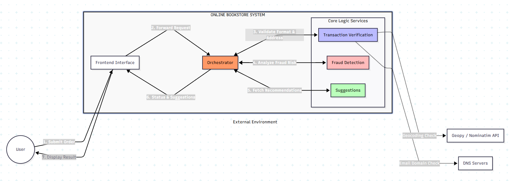
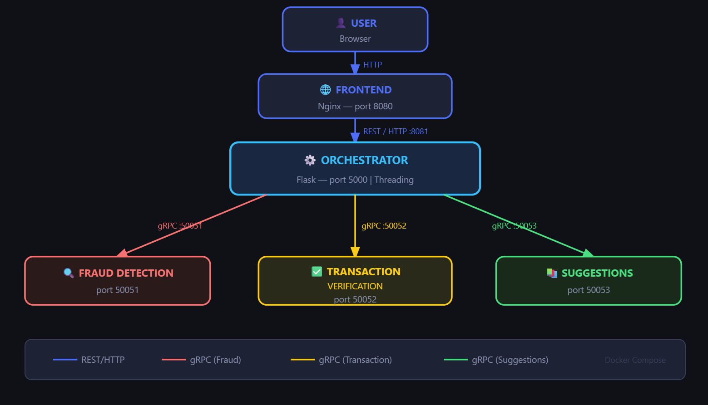

# Documentation

# Online Bookshop - Distributed Systems

A distributed bookshop system built for the Distributed Systems course at University of Tartu.

## Team Members
- Tofig Movsumov - Suggestions Service
- Hikmat Azimzada - Fraud Detection Service  
- Arthur Marie - Transaction Verification Service

## System Overview
When a user places an order, the Orchestrator receives the request and spawns 3 parallel threads to simultaneously call:
- **Fraud Detection** - validates the credit card and detects fraudulent orders
- **Transaction Verification** - validates user data, card format, email and address
- **Suggestions** - returns a list of recommended books

## Services

| Service | Port | Technology |
|---|---|---|
| Frontend | 8080 | Nginx |
| Orchestrator | 8081 | Flask + gRPC client |
| Fraud Detection | 50051 | gRPC server |
| Transaction Verification | 50052 | gRPC server |
| Suggestions | 50053 | gRPC server |

## How to Run

### Requirements
- Docker
- Docker Compose

### Start the system
```bash
docker compose up --build
```

### Access the app
Open your browser at: http://localhost:8080

## Communication
- **Frontend → Orchestrator**: REST/HTTP
- **Orchestrator → Services**: gRPC (parallel threads)

## System Diagram



## Architecture Diagram
