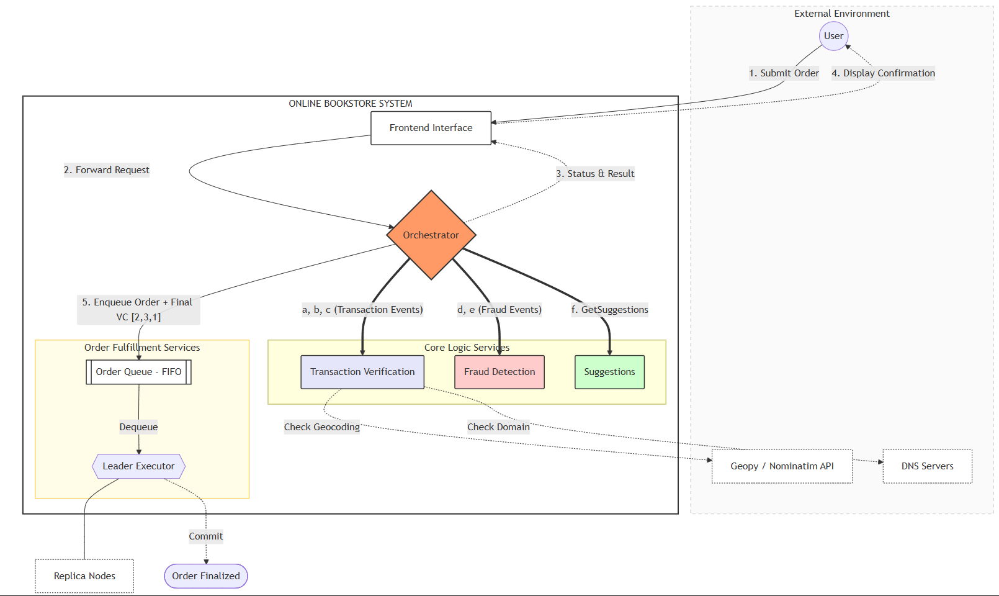
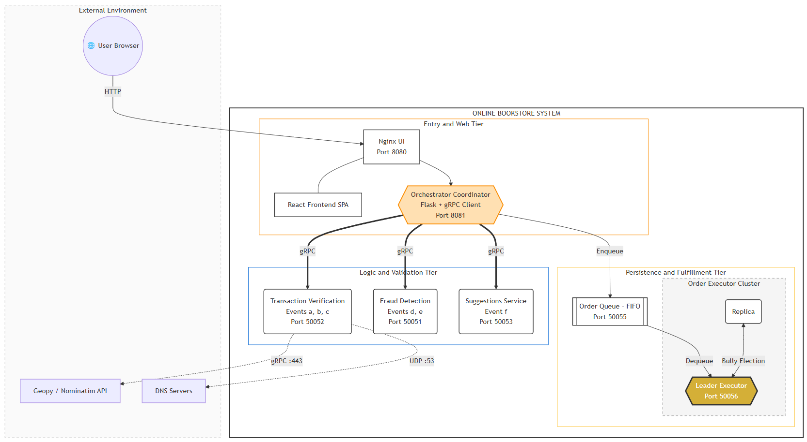
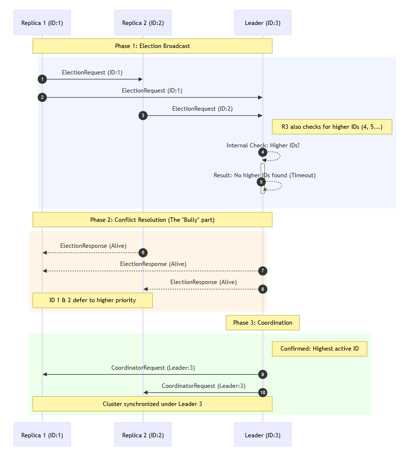
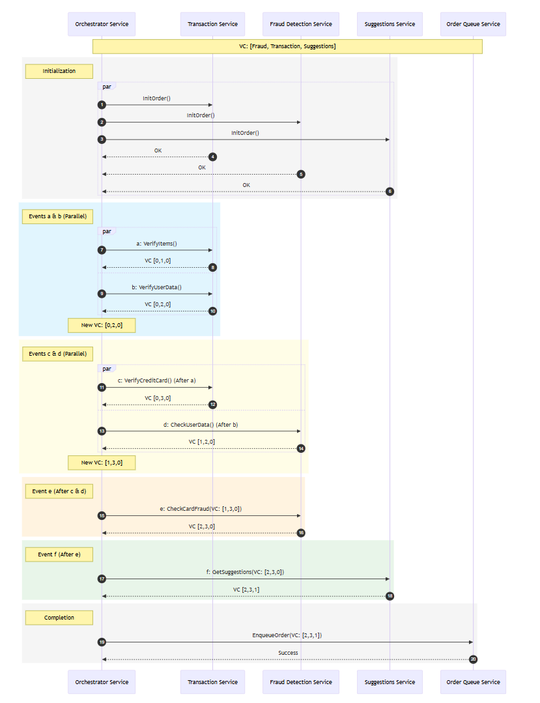
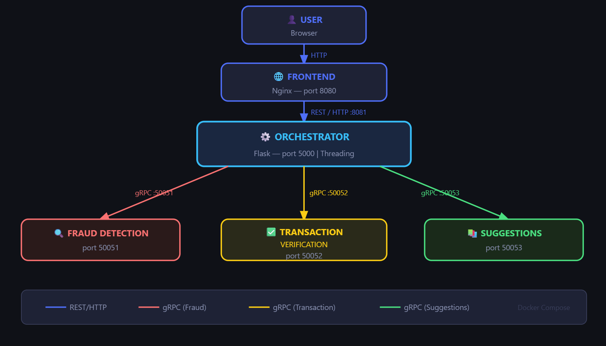

# Online Bookshop — Distributed Systems

A distributed bookshop system built for the Distributed Systems course at University of Tartu.

## Team Members

- Tofig Movsumov — Suggestions Service + Orchestrator
- Hikmat Azimzade — Fraud Detection Service
- Arthur Marie — Transaction Verification Service

## System Overview

When a user places an order, the Orchestrator receives the request and drives
a causally ordered event flow across three backend services. Each service
maintains a vector clock to track causal relationships between events.
Approved orders are enqueued into a FIFO Order Queue and executed by a
leader-elected Order Executor replica.

## Services

| Service | Port | Technology | Role |
|---|---|---|---|
| Frontend | 8080 | Nginx | UI |
| Orchestrator | 8081 | Flask + gRPC client | Coordinator |
| Fraud Detection | 50051 | gRPC server | Events d, e |
| Transaction Verification | 50052 | gRPC server | Events a, b, c |
| Suggestions | 50053 | gRPC server | Event f |
| Order Queue | 50055 | gRPC server | FIFO queue |
| Order Executor | 50056 | gRPC server (3 replicas) | Leader election |

## Event Flow (Checkpoint 2)

InitOrder (all 3 services, parallel)
↓
(a) VerifyItems ‖ (b) VerifyUserData       [Transaction]
↓
(c) VerifyCreditCard ‖ (d) CheckUserData   [Transaction ‖ Fraud]
↓
(e) CheckCardFraud                         [Fraud]
↓
(f) GetSuggestions                         [Suggestions]
↓
Enqueue → Order Executor (leader executes)


If any event fails, the order is immediately rejected and remaining
events are skipped.

## Vector Clocks

Each service owns one slot in the vector clock `[fraud, transaction, suggestions]`.
On every event, the service merges the incoming clock and increments its own slot.
This establishes causal ordering across all distributed events.

Example trace from a live order:
InitOrder:       [0, 0, 0]
Events a, b:     [0, 1, 0] → [0, 2, 0]
Events c, d:     [0, 3, 0] ‖ [1, 2, 0]
After merge:     [1, 3, 0]
Event e:         [2, 3, 0]
Event f:         [2, 3, 1]


## Leader Election — Bully Algorithm

Three Order Executor replicas elect a leader on startup. Each replica sends
ELECTION messages to higher-ID replicas. If no higher replica responds, it
declares itself leader via COORDINATOR broadcast. Replica 3 always wins in
a healthy system. Only the leader dequeues and executes orders.

## How to Run

### Requirements
- Docker
- Docker Compose

### Start the system
```bash
docker compose up --build
```

### Access the app
Open your browser at: http://localhost:8080

## Communication

- **Frontend → Orchestrator**: REST/HTTP
- **Orchestrator → Services**: gRPC (sequential and parallel per event flow)
- **Order Executors → Each other**: gRPC (election messages)
- **Order Executor (leader) → Order Queue**: gRPC (Dequeue)

## Diagrams
### System model Diagram

### Architecture model Diagram

### Bully Election Diagram

### Vector Clock Diagram


## Documentation


## Architecture Diagram


## Election Bully Diagram


## Vector Clock Diagram simulation

