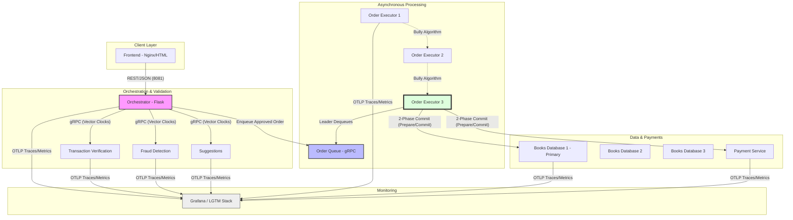

# Architecture Diagram

```mermaid
graph TD
    subgraph Client_Layer [Client Layer]
        FE[Frontend - Nginx/HTML]
    end

    subgraph Orchestration_Layer [Orchestration & Validation]
        ORC[Orchestrator - Flask]
        TV[Transaction Verification]
        FD[Fraud Detection]
        SUG[Suggestions]
    end

    subgraph Processing_Layer [Asynchronous Processing]
        OQ[Order Queue - gRPC]
        OE1[Order Executor 1]
        OE2[Order Executor 2]
        OE3[Order Executor 3]
    end

    subgraph Data_Layer [Data & Payments]
        DB1[Books Database 1 - Primary]
        DB2[Books Database 2]
        DB3[Books Database 3]
        PAY[Payment Service]
    end

    subgraph Observability_Layer [Monitoring]
        GRAF[Grafana / LGTM Stack]
    end

    %% Communications
    FE -- "REST/JSON (8081)" --> ORC

    %% Orchestrator Flow with Vector Clocks
    ORC -- "gRPC (Vector Clocks)" --> TV
    ORC -- "gRPC (Vector Clocks)" --> FD
    ORC -- "gRPC (Vector Clocks)" --> SUG
    ORC -- "Enqueue Approved Order" --> OQ

    %% Leader Election & Dequeue
    OE1 -. "Bully Algorithm" .-> OE2
    OE2 -. "Bully Algorithm" .-> OE3
    OE3 -- "Leader Dequeues" --> OQ

    %% 2PC Transaction
    OE3 -- "2-Phase Commit (Prepare/Commit)" --> DB1
    OE3 -- "2-Phase Commit (Prepare/Commit)" --> PAY

    %% Observability
    ORC & TV & FD & SUG & OE1 & DB1 & PAY -- "OTLP Traces/Metrics" --> GRAF

    %% Styling
    style ORC fill:#f9f,stroke:#333,stroke-width:2px
    style OQ fill:#bbf,stroke:#333,stroke-width:2px
    style OE3 fill:#dfd,stroke:#333,stroke-width:4px
    style GRAF fill:#eee,stroke:#333,dash-array: 5 5
```
